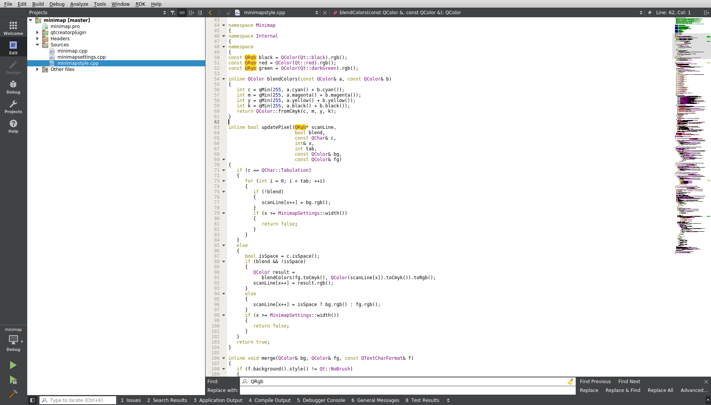

# Minimap Qt Creator plugin

The minimap Qt Creator plugin lets the user use a "minimap" as scrollbar for text editors.

The minimap is only visible if is enabled, and text wrapping is **disabled** and if the line count of the file is less than the *Line Count Threshold* setting. If these criterias are not met an ordinary scrollbar is shown.

Larger textfiles tend to render a rather messy minimap. Therefore the setting *Line Count Threshold* exist for the user to customize when the minimap is to be shown or not.

You can edit the settings under *Minimap* tab in the *Text Editor* category. There are three settings available:

* Enabled

    Uncheck this box to completely disable the minimap srcollbar

* Width

    The width in pixels of the scrollbar.

* Line Count Threshold

    The threshold where minimap scrollbar
